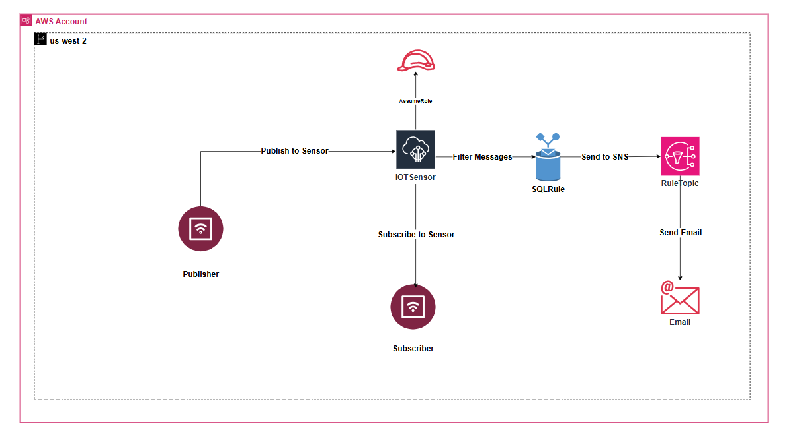

# AWS IoT Core Builder's Day - MQTT Publisher/Subscriber Lab
**AWS Certified Cloud Practitioner**  
*Hands-on lab with AWS IoT Core, MQTT messaging, and SNS integration*


---

## Prerequisites
- AWS Account with admin access
- All resources will be created in **us-west-2**
- CloudShell access

---

## Task 1: Create IoT Policy, Thing, and Publisher

### 1.1 Create IoT Policy
1. **Navigate to AWS IoT Core service**
2. **In left menu: Security → Policies**
3. **Click "Create policy"**
4. **Policy configuration:**
   - Policy name: `IoTPolicy`
   - Click "JSON" tab and paste:
   ```json
   {
     "Version": "2012-10-17",
     "Statement": [
       {
         "Effect": "Allow",
         "Action": "iot:*",
         "Resource": "*"
       }
     ]
   }
   ```
5. **Click "Create"**

### 1.2 Create IoT Thing with Certificate
1. **In left menu: All devices → Things**
2. **Click "Create things"**
3. **Select "Create single thing" → Click "Next"**
4. **Thing properties:**
   - Thing name: `MySensor`
   - Leave other settings as default
5. **Click "Next"**
6. **Device certificate:**
   - Select **"Auto-generate a new certificate"**
7. **Click "Next"**
8. **Attach policies:**
   - Select `IoTPolicy` (checkbox)
9. **Click "Create thing"**
10. **Download certificates** (this is your ONLY chance):
    - Download **Device certificate** (ends with `-certificate.pem.crt`)
    - Download **Private key file** (ends with `-private.pem.key`)
    - Download **Amazon Root CA 1** (optional, but recommended)
11. **Click "Done"**

### 1.3 Get IoT Endpoint
1. **In left menu: Settings**
2. **Copy your Device data endpoint** (looks like: `xxxxx-ats.iot.us-west-2.amazonaws.com`)
3. **Save this endpoint** - you'll need it multiple times

### 1.4 Set Up Publisher in CloudShell
1. **Open CloudShell** (icon in top navigation bar)
2. **Create Python virtual environment:**
   ```bash
   python3 -m venv .venv && source .venv/bin/activate
   ```

3. **Install AWS IoT SDK:**
   ```bash
   git clone https://github.com/aws/aws-iot-device-sdk-python-v2.git
   pip install ./aws-iot-device-sdk-python-v2
   ```

4. **Create publisher script:**
   ```bash
   nano publisher.py
   ```
   - Copy code from: https://github.com/buildwithbrainyl/ccp/blob/main/builders-day/iot/publisher.py
   - Paste into nano editor
   - Press `Ctrl+O` to save, `Enter` to confirm, `Ctrl+X` to exit
Alternatively, execute the following command:
```bash
wget https://raw.githubusercontent.com/buildwithbrainyl/ccp/main/builders-day/iot/publisher.py -O publisher.py
```
5. **Upload certificates to CloudShell:**
   - Click **Actions → Upload file** in CloudShell
   - Upload your downloaded `*-certificate.pem.crt` file
   - Click **Actions → Upload file** again
   - Upload your downloaded `*-private.pem.key` file

6. **Run the publisher:**
   ```bash
   python publisher.py \
     --endpoint YOUR-ENDPOINT-ats.iot.us-west-2.amazonaws.com \
     --cert YOUR-CERT-certificate.pem.crt \
     --key YOUR-KEY-private.pem.key
   ```
   Replace `YOUR-ENDPOINT`, `YOUR-CERT`, and `YOUR-KEY` with your actual values.

### 1.5 Verify Messages in MQTT Test Client
1. **In AWS IoT Console, left menu: MQTT test client**
2. **Click "Subscribe to a topic"**
3. **Topic filter:** `demo/topic`
4. **Click "Subscribe"**
5. **Expected Result:** You should see JSON messages appearing with count, message, and timestamp

---

## Task 2: Create MQTT Subscriber

### 2.1 Open New CloudShell Tab
1. **In CloudShell, click the "+" icon** to open a new tab
2. **Activate Python environment:**
   ```bash
   source .venv/bin/activate
   ```

### 2.2 Create Subscriber Script
1. **Create subscriber script:**
   ```bash
   nano subscriber.py
   ```
   - Copy code from: https://github.com/buildwithbrainyl/ccp/blob/main/builders-day/iot/subscriber.py
   - Paste into nano editor
   - Press `Ctrl+O` to save, `Enter` to confirm, `Ctrl+X` to exit

### 2.3 Run Subscriber
1. **Run the subscriber:**
   ```bash
   python subscriber.py \
     --endpoint YOUR-ENDPOINT-ats.iot.us-west-2.amazonaws.com \
     --cert YOUR-CERT-certificate.pem.crt \
     --key YOUR-KEY-private.pem.key \
     --topic demo/topic
   ```
   Replace `YOUR-ENDPOINT`, `YOUR-CERT`, and `YOUR-KEY` with your actual values.

2. **Expected Output:**
   - "Connected to AWS IoT Core"
   - "Successfully subscribed to 'demo/topic'"
   - "Waiting for messages..."

### 2.4 Test Publisher and Subscriber
1. **Switch back to the first CloudShell tab** (where publisher is)
2. **Run publisher again:**
   ```bash
   python publisher.py \
     --endpoint YOUR-ENDPOINT-ats.iot.us-west-2.amazonaws.com \
     --cert YOUR-CERT-certificate.pem.crt \
     --key YOUR-KEY-private.pem.key
   ```
3. **Switch to the subscriber tab**
4. **Expected Result:** You should see messages appearing in the subscriber output

---

## Task 3: Route Messages to SNS via IoT Rule

### 3.1 Create IAM Role for IoT
1. **Navigate to IAM service**
2. **Left menu: Roles → Click "Create role"**
3. **Trusted entity:**
   - Select **AWS service**
   - Use case: **IoT**
   - Select **IoT** from the dropdown
   - Click "Next"
4. **Add permissions:**
   - Search for and select: `AmazonSNSFullAccess`
   - Click "Next"
5. **Role details:**
   - Role name: `IoTtoSNSRole`
6. **Click "Create role"**

### 3.2 Create SNS Topic and Email Subscription
1. **Navigate to SNS service**
2. **Left menu: Topics → Click "Create topic"**
3. **Topic configuration:**
   - Type: **Standard**
   - Name: `IoTMessages`
4. **Click "Create topic"**
5. **Create subscription:**
   - Click **"Create subscription"** button
   - Protocol: **Email**
   - Endpoint: **Your email address**
   - Click "Create subscription"
6. **Check your email and click the confirmation link**

### 3.3 Create IoT Rule
1. **Navigate back to AWS IoT Core service**
2. **Left menu: Message routing → Rules**
3. **Click "Create rule"**
4. **Rule properties:**
   - Rule name: `DemoTopicToSNS`
   - Description: `Route messages to SNS`
   - Click "Next"
5. **Configure SQL statement:**
   ```sql
   SELECT * FROM 'demo/topic' WHERE count > 4
   ```
   - Click "Next"
6. **Rule actions:**
   - Click "Add action"
   - Select **"Simple Notification Service (SNS)"**
   - Click "Next"
7. **Configure SNS action:**
   - SNS topic: Select `IoTMessages`
   - Message format: **RAW**
   - IAM role: Select `IoTtoSNSRole`
   - Click "Next"
8. **Error action (optional but recommended):**
   - Click "Add action"
   - Select **"Simple Notification Service (SNS)"**
   - Select same topic: `IoTMessages`
   - Select same role: `IoTtoSNSRole`
   - Click "Next"
9. **Review and click "Create"**

### 3.4 Test End-to-End
1. **Go back to CloudShell tab with publisher**
2. **Run publisher:**
   ```bash
   python publisher.py \
     --endpoint YOUR-ENDPOINT-ats.iot.us-west-2.amazonaws.com \
     --cert YOUR-CERT-certificate.pem.crt \
     --key YOUR-KEY-private.pem.key \
     --count 10
   ```
3. **Expected Results:**
   - Messages with count 5-10 should trigger the IoT rule
   - You should receive emails for messages where count > 4
   - Check your email inbox

---

## Testing Summary
✅ **Task 1:** Published messages visible in MQTT test client  
✅ **Task 2:** Subscriber receives messages in CloudShell  
✅ **Task 3:** Email notifications received via SNS for count > 4  

---

## Clean Up (Optional)
1. **IoT Core:**
   - Delete Thing: `MySensor`
   - Delete Policy: `IoTPolicy`
   - Delete Rule: `DemoTopicToSNS`
2. **SNS:**
   - Delete Topic: `IoTMessages`
3. **IAM:**
   - Delete Role: `IoTtoSNSRole`
4. **CloudShell:**
   - Files will be automatically cleaned up when session expires

---

## Troubleshooting

### Publisher/Subscriber Connection Issues
- Verify your endpoint is correct (from IoT Core → Settings)
- Verify certificate filenames match exactly
- Ensure certificates are in the same directory where you run the script
- Check that `IoTPolicy` is attached to your Thing's certificate

### Not Receiving SNS Emails
- Confirm email subscription is confirmed (check spam folder)
- Verify IoT rule SQL: messages must have count > 4
- Run publisher with `--count 10` to ensure some messages meet the criteria

### Python SDK Issues
- Ensure virtual environment is activated: `source .venv/bin/activate`
- Reinstall SDK if needed: `pip install ./aws-iot-device-sdk-python-v2`

---

**Lab Complete! You've successfully:**
- Created IoT Things and secured them with policies
- Published and subscribed to MQTT messages
- Routed IoT messages to SNS using IoT Rules

