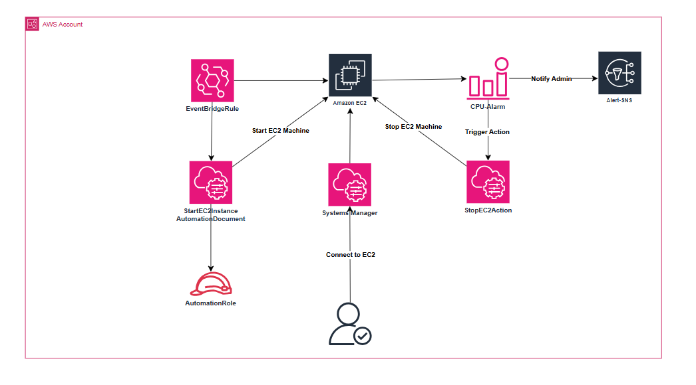

# EC2 Monitoring & Automation Lab
**AWS Certified Cloud Practitioner / Associate Level**  
Learn EC2 monitoring and automation using Systems Manager, CloudWatch Alarms, SNS, and EventBridge - all through the AWS Management Console.

---

## Lab Overview
Build an automated EC2 monitoring and recovery system that:
1. **Connects to EC2** using Systems Manager Session Manager
2. **Monitors EC2 CPU** with CloudWatch alarms and SNS notifications
3. **Automates recovery** using EventBridge and Systems Manager Automation

**Architecture Flow:**
- EC2 Instance → CloudWatch Alarm → SNS → EC2 Stop
- EC2 State Change → EventBridge → Systems Manager → EC2 Start

---

## Prerequisites
- AWS account with Administrator access
- **Web browser** with access to AWS Management Console
- **Email address** for SNS notifications
- **Region**: All tasks must be done in **us-west-2** for consistency

---

## Task 1: EC2 Setup with Systems Manager

### Step 1: Create IAM Role for EC2
1. **Navigate** to IAM service
2. **Click** "Roles" → "Create role"
3. **Select** "AWS service" → "EC2"
4. **Click "Next"** → **Attach policies**:
   - Search and select `AmazonSSMManagedInstanceCore`
5. **Role name**: `EC2-SSM-Role`
6. **Click "Create role"**

### Step 2: Launch EC2 Instance
1. **Navigate** to EC2 service → **Click "Launch Instance"**
2. **Configuration**:
   - **Name**: `MonitoredServer`
   - **AMI**: Amazon Linux 2023 AMI
   - **Instance type**: t3.micro
   - **Key pair**: Proceed without a key pair (not needed for SSM)
   - **Security group**: Create new with default settings
   - **IAM instance profile**: Select `EC2-SSM-Role`
3. **Click "Launch instance"**
4. **Wait** for instance to reach "Running" state
5. **Note the Instance ID** for later use

### Step 3: Test Systems Manager Connection
1. **Navigate** to Systems Manager service
2. **Click** "Session Manager" in left panel
3. **Click "Start session"**
4. **Select** your `MonitoredServer` instance
5. **Click "Start session"**
6. **Verify** you can access the terminal
7. **Type** `whoami` to confirm connection
8. **End session** when done

---

## Task 2: CloudWatch Monitoring with SNS

### Step 1: Create SNS Topic
1. **Navigate** to SNS service
2. **Click** "Create topic"
3. **Type**: Standard
4. **Name**: `EC2-Alerts`
5. **Click "Create topic"**

### Step 2: Subscribe to SNS Topic
1. **Click** "Create subscription"
2. **Protocol**: Email
3. **Endpoint**: Your email address
4. **Click "Create subscription"**
5. **Check your email** and confirm subscription

### Step 3: Create CloudWatch Alarm
1. **Navigate** to CloudWatch service
2. **Click** "Alarms" → "Create alarm"
3. **Click** "Select metric"
4. **Choose** "EC2" → "Per-Instance Metrics"
5. **Find** your instance and select "CPUUtilization"
6. **Click "Select metric"**

### Step 4: Configure Alarm Conditions
1. **Statistic**: Average
2. **Period**: 5 minutes
3. **Threshold type**: Static
4. **Condition**: Greater than 80
5. **Click "Next"**

### Step 5: Configure Alarm Actions
1. **Alarm state trigger**: In alarm
2. **Notification SNS topic**: Select `EC2-Alerts`
3. **EC2 action**: Stop this instance
4. **Click "Next"**

### Step 6: Complete Alarm Setup
1. **Alarm name**: `CPU-High-Stop-Instance`
2. **Description**: `Stop instance when CPU > 80%`
3. **Click "Next"** → **Create alarm**

### Step 7: Test Alarm with CloudShell
1. **Open** CloudShell (icon in top navigation bar)
2. **Run** the following command (replace `ALARM_NAME` with your alarm name):
```bash
aws cloudwatch set-alarm-state --alarm-name "CPU-High-Stop-Instance" --state-value ALARM --state-reason "Testing alarm"
```
3. **Navigate** to EC2 console
4. **Verify** your instance stops within a few minutes
5. **Check your email** for alarm notification

---

## Task 3: EventBridge Automation

### Step 1: Create Automation Role
1. **Navigate** to IAM service
2. **Click** "Roles" → "Create role"
3. **Select** "AWS service" → "Systems Manager"
4. **Click "Next"** → **Attach policies**:
   - Search and select `AmazonEC2FullAccess`
5. **Role name**: `SSM-EC2-Automation-Role`
6. **Click "Create role"**

### Step 2: Create EventBridge Rule
1. **Navigate** to EventBridge service
2. **Click** "Rules" → "Create rule"
3. **Name**: `EC2-Stopped-AutoRestart`
4. **Description**: `Auto-restart EC2 when stopped`
5. **Event bus**: default
6. **Click "Next"**

### Step 3: Configure Event Pattern
1. **Event source**: AWS services
2. **AWS service**: EC2
3. **Event type**: EC2 Instance State-change Notification
4. **Specific state(s)**: stopped
5. **Specific instance(s)**: Select your instance ID
6. **Click "Next"**

### Step 4: Configure Target
1. **Target type**: AWS service
2. **Service**: Systems Manager Automation
3. **Document**: AWS-StartEC2Instance
4. **Create a new role**: Yes (check the box)
5. **Configure input**:
   - **InstanceId**: Your EC2 instance ID
   - **AutomationAssumeRole**: `arn:aws:iam::ACCOUNT-ID:role/SSM-EC2-Automation-Role`
     (Replace ACCOUNT-ID with your AWS account ID)
6. **Click "Next"**

### Step 5: Complete Rule Creation
1. **Review** configuration
2. **Click "Create rule"**

### Step 6: Test Complete Automation
1. **Open** CloudShell
2. **Run** the alarm trigger command again:
```bash
aws cloudwatch set-alarm-state --alarm-name "CPU-High-Stop-Instance" --state-value ALARM --state-reason "Testing automation"
```
3. **Monitor** EC2 console:
   - Instance should stop (from alarm action)
   - Instance should start automatically (from EventBridge rule)
4. **Check** Systems Manager → Automation executions for the start automation
5. **Verify** you received email notification

---

## Verification Steps

### Task 1 Verification
- ✅ EC2 instance running with SSM role
- ✅ Successfully connect via Session Manager

### Task 2 Verification  
- ✅ SNS topic created and email subscribed
- ✅ CloudWatch alarm triggers and stops instance
- ✅ Email notification received

### Task 3 Verification
- ✅ EventBridge rule captures EC2 state change
- ✅ Systems Manager automatically starts stopped instance
- ✅ Complete automation cycle works

---

## Cleanup

### Step 1: Delete EventBridge Rule
1. **Navigate** to EventBridge → Rules
2. **Select** `EC2-Stopped-AutoRestart`
3. **Click** "Delete"

### Step 2: Delete CloudWatch Alarm
1. **Navigate** to CloudWatch → Alarms
2. **Select** `CPU-High-Stop-Instance`
3. **Click** "Delete"

### Step 3: Delete SNS Resources
1. **Navigate** to SNS
2. **Delete** subscription from `EC2-Alerts` topic
3. **Delete** `EC2-Alerts` topic

### Step 4: Terminate EC2 Instance
1. **Navigate** to EC2
2. **Select** `MonitoredServer` instance
3. **Instance State** → "Terminate instance"

### Step 5: Delete IAM Roles
1. **Navigate** to IAM → Roles
2. **Delete** `EC2-SSM-Role`
3. **Delete** `SSM-EC2-Automation-Role`
4. **Delete** EventBridge-created role (search for "EC2-Stopped-AutoRestart")

---

## Key Takeaways

### Monitoring & Automation Benefits
- **Proactive monitoring**: Detect issues before they impact users
- **Automated response**: Reduce manual intervention and response time
- **Cost optimization**: Stop/start instances based on conditions

### AWS Services Integration
- **Systems Manager**: Secure instance access and automation
- **CloudWatch**: Comprehensive monitoring and alerting
- **SNS**: Multi-channel notification system
- **EventBridge**: Event-driven automation orchestration

### Best Practices Demonstrated
- ✅ **IAM roles** with specific permissions for each service
- ✅ **Automated remediation** to reduce manual operations
- ✅ **Event-driven architecture** for real-time responses
- ✅ **Monitoring alerts** for operational visibility

---

## Resources
- [AWS Systems Manager Documentation](https://docs.aws.amazon.com/systems-manager/)
- [Amazon CloudWatch User Guide](https://docs.aws.amazon.com/cloudwatch/)
- [Amazon SNS Developer Guide](https://docs.aws.amazon.com/sns/)
- [Amazon EventBridge User Guide](https://docs.aws.amazon.com/eventbridge/)

---

**🎯 Learning Objectives Achieved:**
- ✅ Configure secure EC2 access with Systems Manager
- ✅ Implement comprehensive monitoring with CloudWatch
- ✅ Set up automated notifications with SNS
- ✅ Create event-driven automation with EventBridge
- ✅ Build end-to-end monitoring and recovery workflows
