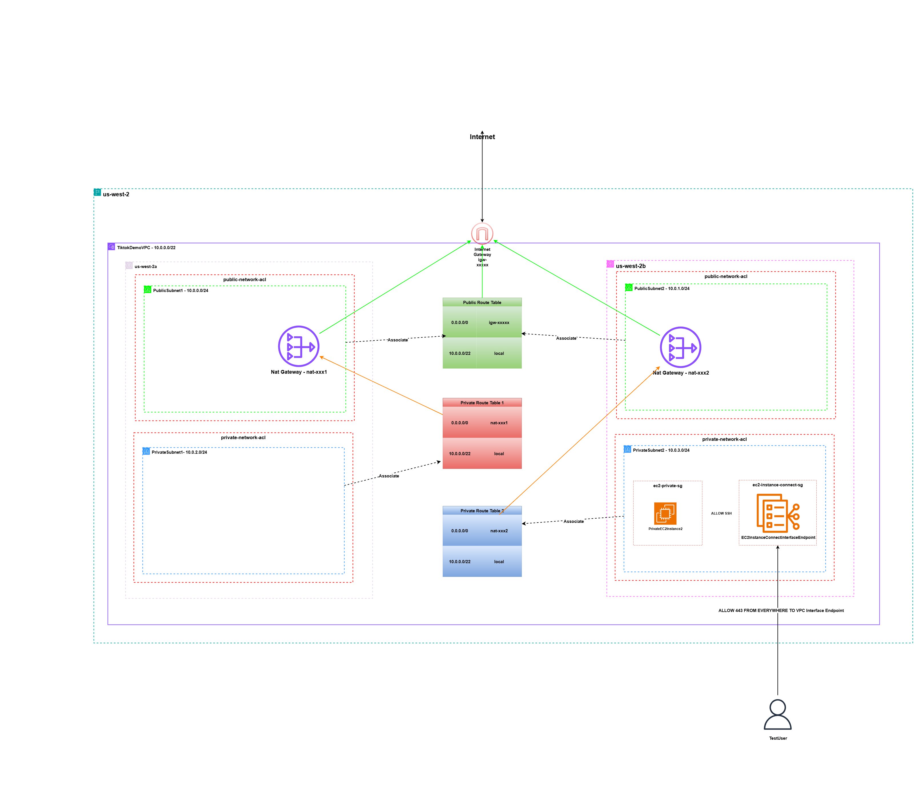

# TikTokDemoVPC - Console VPC Hands-On (Beginner Friendly)
**AWS Certified Cloud Practitioner**  
*Build the exact VPC from the diagram via the AWS Management Console*

---

## Prerequisites
- Region: **us-west-2**
- Account with Administrator access
- All steps use the **AWS Console only**

---

## Architecture From Diagram (Exact Names & CIDRs)
- **VPC:** `TikTokDemoVPC` — CIDR `10.0.0.0/22`
- **AZs:** `us-west-2a`, `us-west-2b`
- **PublicSubnet1 (us-west-2a):** `10.0.0.0/24`
- **PublicSubnet2 (us-west-2b):** `10.0.1.0/24`
- **PrivateSubnet1 (us-west-2a):** `10.0.2.0/24`
- **PrivateSubnet2 (us-west-2b):** `10.0.3.0/24`
- **Internet Gateway:** attached to VPC
- **NAT Gateways:**
  - `nat-xxx1` in `PublicSubnet1`
  - `nat-xxx2` in `PublicSubnet2`
- **Route Tables:**
  - `Public Route Table`: 0.0.0.0/0 → IGW; associated with both public subnets
  - `Private Route Table 1`: 0.0.0.0/0 → `nat-xxx1`; associated with `PrivateSubnet1`
  - `Private Route Table 2`: 0.0.0.0/0 → `nat-xxx2`; associated with `PrivateSubnet2`
- **Security Groups:**
  - `ec2-private-sg` (for instances in private subnets)
  - `ec2-instance-connect-sg` (for the interface endpoint)
- **Endpoint:** `EC2InstanceConnectInterfaceEndpoint` in `PrivateSubnet2`
  - Note on diagram: "ALLOW 443 FROM EVERYWHERE TO VPC Interface Endpoint"

---

## Architecture Diagram


---

## Task 1: Create VPC and Subnets (Manual, No Auto-Generation)
### 1.1 Create the VPC
1. Console → VPC → Your VPCs → Create VPC
2. Resources to create: `VPC only`
3. Name tag: `TikTokDemoVPC`
4. IPv4 CIDR block: `10.0.0.0/22`
5. IPv6 CIDR block: `No IPv6 CIDR block`
6. Tenancy: `Default`
7. Create VPC
8. Select the new VPC → Actions → Edit VPC settings → Ensure both `DNS hostnames` and `DNS resolution` are Enabled → Save

### 1.2 Create the Subnets (exact names, AZs, and CIDRs)
Create each subnet one by one:

1) Subnet: `PublicSubnet1`
- VPC: `TikTokDemoVPC`
- Availability Zone: `us-west-2a`
- IPv4 CIDR block: `10.0.0.0/24`
- Create subnet → then select it → Actions → `Edit subnet settings` → turn ON `Auto-assign IP settings` → check `Enable auto-assign public IPv4 address` → Save

2) Subnet: `PublicSubnet2`
- VPC: `TikTokDemoVPC`
- Availability Zone: `us-west-2b`
- IPv4 CIDR block: `10.0.1.0/24`
- Enable auto-assign public IPv4 as above

3) Subnet: `PrivateSubnet1`
- VPC: `TikTokDemoVPC`
- Availability Zone: `us-west-2a`
- IPv4 CIDR block: `10.0.2.0/24`
- Leave auto-assign public IPv4 `Disabled`

4) Subnet: `PrivateSubnet2`
- VPC: `TikTokDemoVPC`
- Availability Zone: `us-west-2b`
- IPv4 CIDR block: `10.0.3.0/24`
- Leave auto-assign public IPv4 `Disabled`

---

## Task 2: Internet Gateway
1. VPC → Internet Gateways → Create IGW → name: `TikTokDemoVPC-igw`
2. Attach to `TikTokDemoVPC`

---

## Task 3: NAT Gateways (One per Public Subnet)
1. VPC → NAT Gateways → Create NAT gateway
   - Name: `nat-xxx1`
   - Subnet: `PublicSubnet1`
   - Connectivity type: Public
   - Allocate new Elastic IP → Create NAT gateway
2. Create another NAT
   - Name: `nat-xxx2`
   - Subnet: `PublicSubnet2`
   - Allocate new Elastic IP → Create

Wait until both NAT gateways are Available.

---

## Task 4: Route Tables (Three Tables)
1. VPC → Route tables → Create route table
   - Name: `Public Route Table`
   - VPC: `TikTokDemoVPC`
   - Create
   - Routes → Edit routes → Add route `0.0.0.0/0` → Target: `Internet Gateway`
   - Subnet associations → Edit → select `PublicSubnet1`, `PublicSubnet2`
2. Create route table: `Private Route Table 1`
   - Routes → Add `0.0.0.0/0` → Target: `nat-xxx1`
   - Subnet associations → select `PrivateSubnet1`
3. Create route table: `Private Route Table 2`
   - Routes → Add `0.0.0.0/0` → Target: `nat-xxx2`
   - Subnet associations → select `PrivateSubnet2`

Every route table should also have the implicit local route `10.0.0.0/22 → local`.

---

## Task 5: Security Groups
### 5.1 `ec2-private-sg`
1. EC2 → Security Groups → Create security group
2. Name: `ec2-private-sg` | VPC: `TikTokDemoVPC`
3. Inbound rules:
   - SSH (22) → Source: `ec2-instance-connect-sg` (select the SG as source)
   - HTTP (80) → Source: `10.0.0.0/22`
4. Outbound: leave default (All traffic)

### 5.2 `ec2-instance-connect-sg`
1. Create another SG: Name `ec2-instance-connect-sg` | VPC: `TikTokDemoVPC`
2. Inbound: HTTPS (443) → Source: `0.0.0.0/0`  
   This mirrors the callout in the diagram. You can tighten later to your IPs.
3. Outbound: default (All traffic)

---

## Task 6: EC2 Instances
### 6.1 Private EC2 in PrivateSubnet2 (as shown)
1. EC2 → Launch instances → Name `PrivateEC2Instance02`
2. AMI: Amazon Linux 2023 | Type: t3.micro | Key pair: None (we will use Instance Connect)
3. Network:
   - VPC: `TikTokDemoVPC`
   - Subnet: `PrivateSubnet2 (10.0.3.0/24)`
   - Auto-assign public IP: Disabled
   - Security group: `ec2-private-sg`
4. User data:
```bash
#!/bin/bash
dnf -y update
dnf -y install httpd
systemctl enable --now httpd
echo "<h1>PrivateEC2Instance02 - $(hostname -f)</h1>" > /var/www/html/index.html
```
5. Launch

### 6.2 (Optional) Private EC2 in PrivateSubnet1
Repeat with `PrivateEC2Instance01` in `PrivateSubnet1`.

---

## Task 7: EC2 Instance Connect Interface Endpoint
1. VPC → Endpoints → Create endpoint
2. Service category: AWS services
3. Search: `ec2-instance-connect` → choose `com.amazonaws.us-west-2.ec2-instance-connect`
4. VPC: `TikTokDemoVPC`
5. Subnet: select `PrivateSubnet2`
6. Security group: `ec2-instance-connect-sg`
7. Policy: Full access → Create endpoint

Wait for status Available.

---

## Task 8: Connect to the Private Instance (No Public IP)
1. EC2 → Instances → select `PrivateEC2Instance02` → Connect
2. Choose "EC2 Instance Connect" → Connect
3. You should connect successfully via the interface endpoint.

---

## Task 9: Validate Routing
1. From instance shell:
```bash
curl -I https://aws.amazon.com
```
2. Should succeed via NAT in its AZ (PrivateSubnet2 → `nat-xxx2`).

---

## Cleanup
1. Terminate EC2 instances
2. Delete the VPC endpoint
3. Release Elastic IPs → delete `nat-xxx1` and `nat-xxx2`
4. Detach and delete the Internet Gateway
5. Delete subnets, route tables, then the VPC

---

## Notes
- The diagram explicitly calls out: **ALLOW 443 FROM EVERYWHERE TO VPC Interface Endpoint**. We implemented that on `ec2-instance-connect-sg` (you can scope later).
- Each private subnet egresses through the NAT in the same AZ for HA and to avoid cross-AZ data charges.


